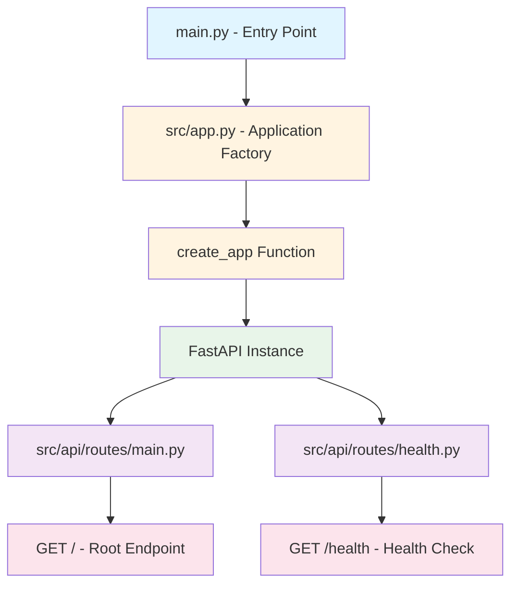

# Project Structure Diagram

## File Organization

| File                       | Purpose             | Lines of Code |
| -------------------------- | ------------------- | ------------- |
| `main.py`                  | Clean entry point   | 16            |
| `src/app.py`               | Application factory | ~18           |
| `src/api/routes/main.py`   | Root endpoint       | ~14           |
| `src/api/routes/health.py` | Health check        | ~10           |

## Benefits

✅ **Modular** - Each route is in its own file  
✅ **Scalable** - Easy to add new routes  
✅ **Clean** - main.py is minimal (16 lines)  
✅ **Testable** - Each module can be tested independently  
✅ **Professional** - Follows industry best practices
